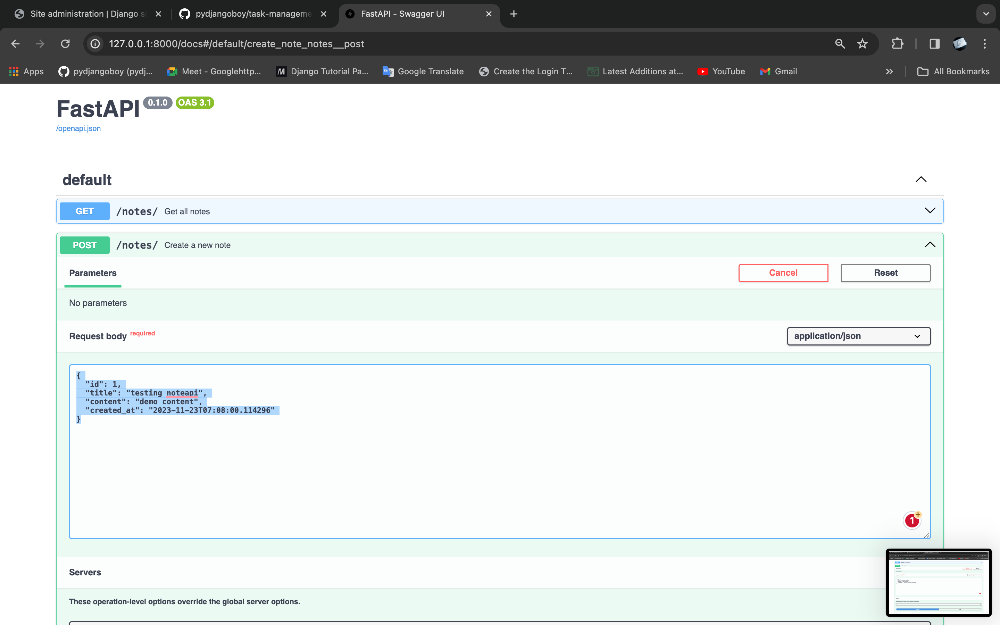
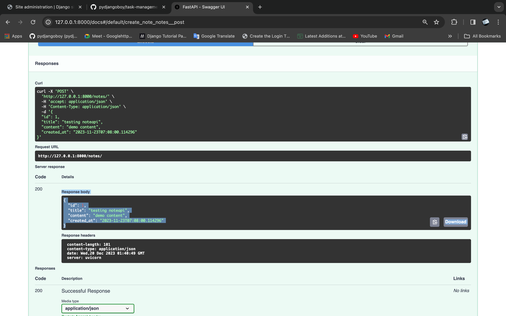
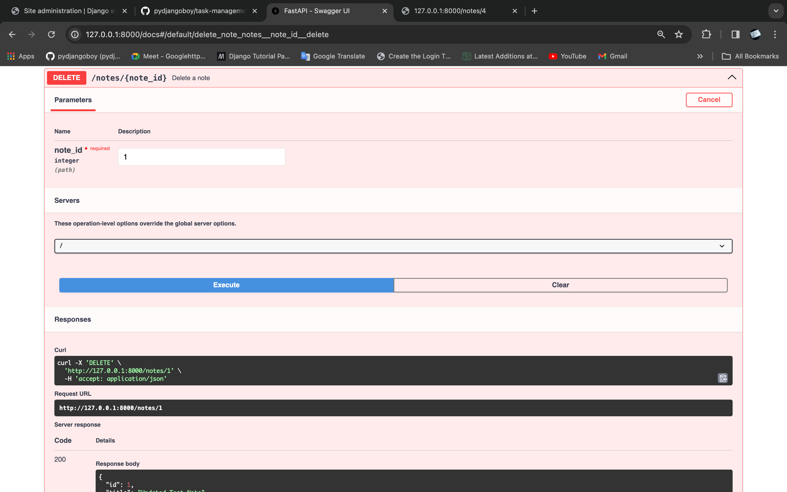
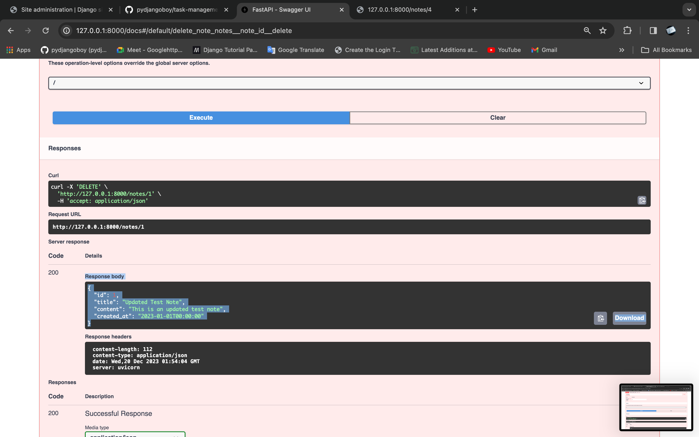
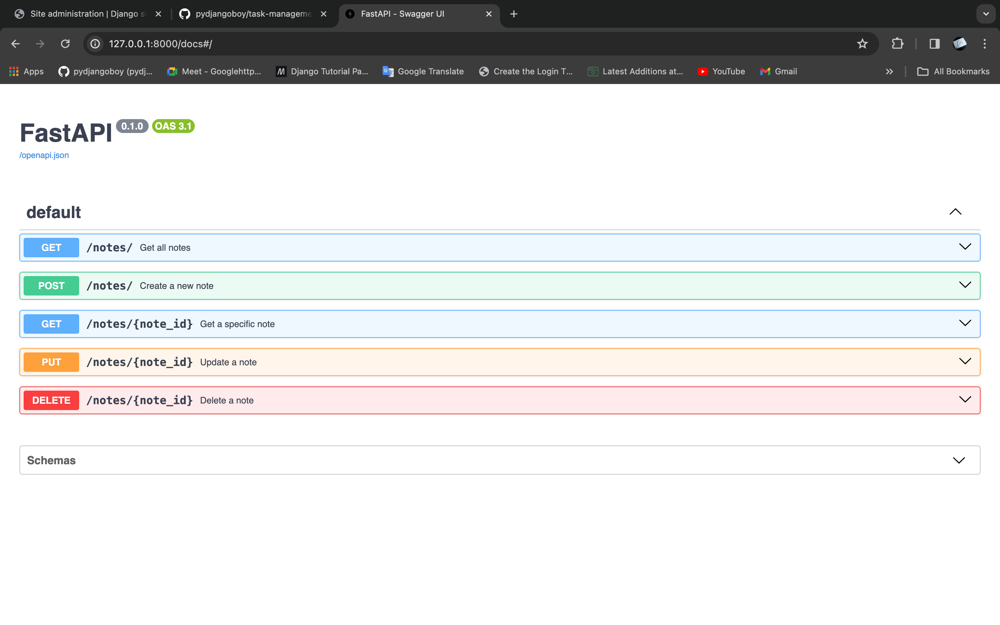
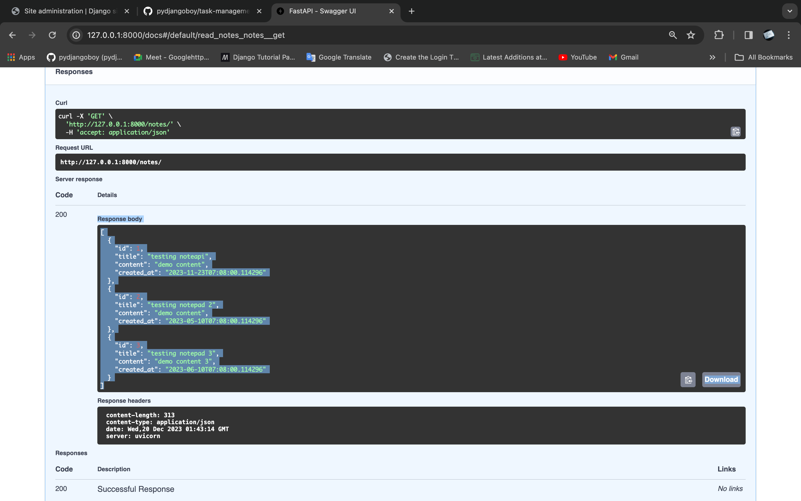
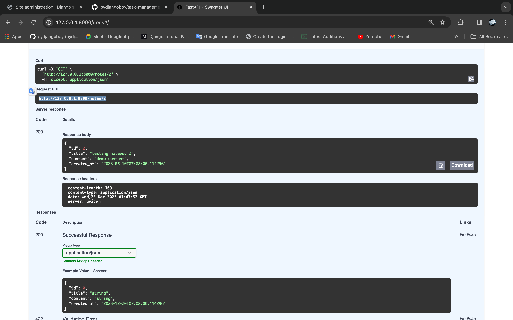
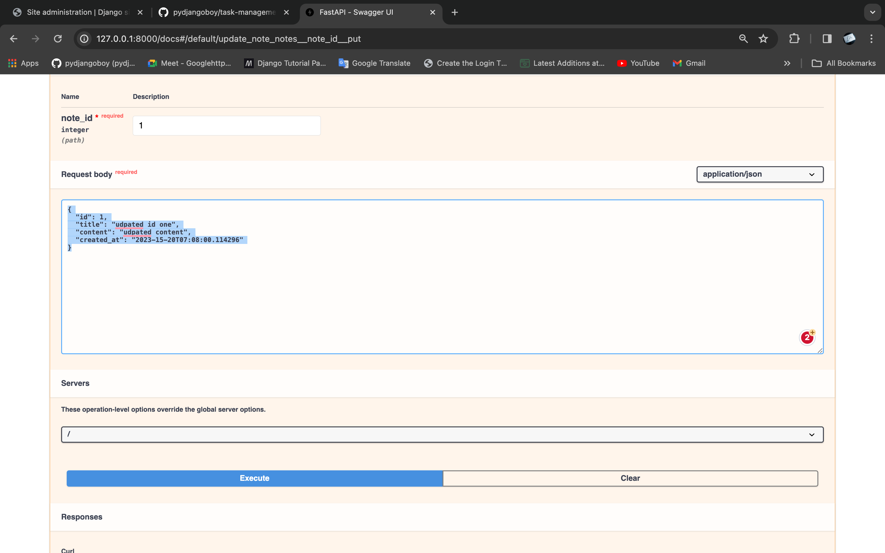
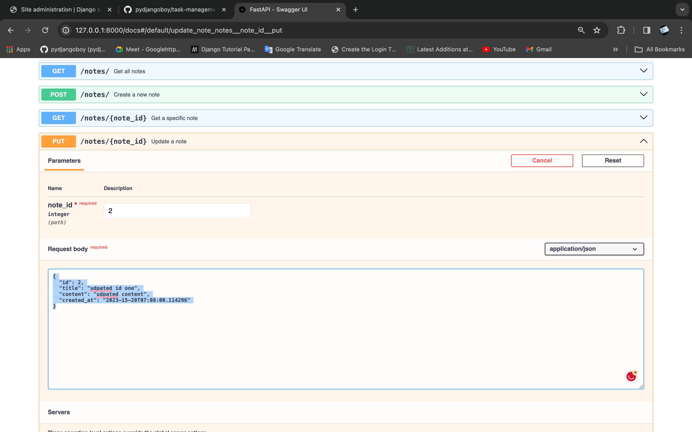
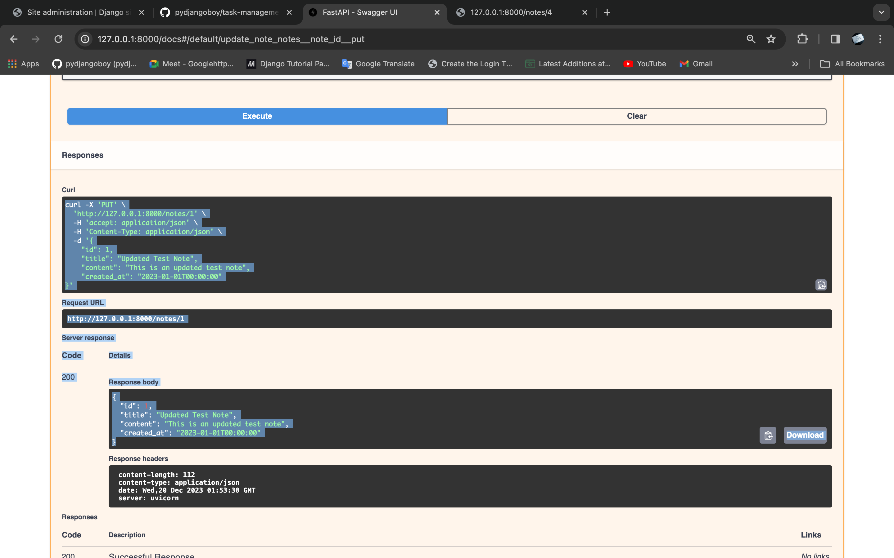

FastAPI NoteAPI project: This is a simple note-taking application built with FastAPI.

# NoteAPI

## Screenshoots

[](./screenshoots/apicreateviewpage.png)
API Create View Page

[](./screenshoots/apicreateviewsuccess.png)
API Create View Success

[](./screenshoots/apideleteviewpage.png)
API Delete View Page

[](./screenshoots/apideleteviewpage2.png)
API Delete View Page 2

[](./screenshoots/apihomepage.png)
API Home Page

[](./screenshoots/apilistviewpage.png)
API List View Page

[](./screenshoots/apispecificpageview.png)
API Specific Page View

[](./screenshoots/apiudpateviewpage.png)
API Update View Page

[](./screenshoots/apiudpateviewpage1.png)
API Update View Page 1

[](./screenshoots/apiupdateviewpage2.png)
API Update View Page 2
...

```markdown
# NoteAPI

This is a simple note-taking application built with FastAPI.

## Setup

1. Clone the repository:

```bash
git clone <your-repository-url>
```

2. Navigate to the project directory:

```bash
cd NoteAPI
```

3. Create a virtual environment and activate it:

```bash
python3 -m venv venv
source venv/bin/activate
```

4. Install the required dependencies:

```bash
pip install -r requirements.txt
```

## Running the Application

To run the application, use the following command:

```bash
uvicorn main:app --reload
```

The application will be available at `http://127.0.0.1:8000`.

## API Endpoints

- `POST /notes/`: Create a new note
- `GET /notes/`: Get all notes
- `GET /notes/{note_id}`: Get a specific note
- `PUT /notes/{note_id}`: Update a note
- `DELETE /notes/{note_id}`: Delete a note

## Testing the Application

You can test the application using the provided `test_main.http` file. This file contains HTTP requests for testing all
the endpoints of the application.

## Documentation

The API documentation is available at `http://127.0.0.1:8000/docs`.

## Sample API Requests and Responses

Here are some sample API requests and responses:

- Creating a note:

Request:

```http
POST http://127.0.0.1:8000/notes/
Content-Type: application/json
Accept: application/json

{
    "id": 1,
    "title": "Test Note",
    "content": "This is a test note",
    "created_at": "2023-01-01T00:00:00"
}
```

Response:

```http
HTTP/1.1 200 OK
Content-Type: application/json

{
    "id": 1,
    "title": "Test Note",
    "content": "This is a test note",
    "created_at": "2023-01-01T00:00:00"
}
```

- Reading all notes:

Request:

```http
GET http://127.0.0.1:8000/notes/
Accept: application/json
```

Response:

```http
HTTP/1.1 200 OK
Content-Type: application/json

[
    {
        "id": 1,
        "title": "Test Note",
        "content": "This is a test note",
        "created_at": "2023-01-01T00:00:00"
    }
]
```

Please replace `<your-repository-url>` with the actual URL of your GitHub repository.

```
